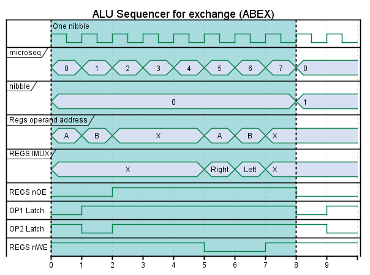
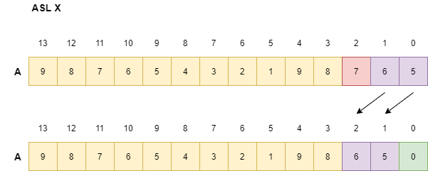

# ALUREGS

This block contains the registers, the adders and the alu sequencer.

# Register file and muxes

The registers are realized using a SRAM (256kBit 32kByte). For the moment only 8 address lines and 4 bits are used. A simpler SRAM like the 2104 could also be used. To latch the registers a pair of 74LS175 are used. These latches provide complementary outputs. Using a MUX one can select which value enters the ADDER normal or the negated.
The negated value is used to implement subtraction.

# Decimal adder

The decimal adder is realized using two 74LS283 4 bit full adders cascaded to perform binary add and decimal adjust adding 6 in case binary or decimal carry occur. A set of or and and gates generate a decimal_adjust signal when this situation occurs.

## Decimal carry generation

The adder/subtracter is a binary adder and uses a second adder to perform decimal adjust. Additions above 9 and binary carry should lead to decimal adjust and carry:

Addition
<table>
    <tr>
        <td>
Input Left
</td>
        <td>
Input Right
</td>
        <td>
Output binary
</td>
        <td>
Output bin carry
</td>
        <td>
Output decimal
</td>
        <td>
Output decimal carry
</td>
    </tr>
    <tr>
        <td>
0100
</td>
        <td>
0101
</td>
        <td>
1001
</td>
        <td>
0
</td>
        <td>
1001
</td>
        <td>
0
</td>
    </tr>
    <tr>
        <td>
0101
</td>
        <td>
0101
</td>
        <td>
1010
</td>
        <td>
0
</td>
        <td>
0000
</td>
        <td>
1
</td>
    </tr>
    <tr>
        <td>
1001
</td>
        <td>
1001
</td>
        <td>
0010
</td>
        <td>
1
</td>
        <td>
1000
</td>
        <td>
1
</td>
    </tr>
</table>

Subtraction
<table>
    <tr>
        <td>
Input Left
</td>
        <td>
Input Right
</td>
        <td>
Output binary
</td>
        <td>
Output bin carry
</td>
        <td>
Output decimal
</td>
        <td>
Output decimal carry
</td>
    </tr>
    <tr>
        <td>
0101
</td>
        <td>
0100
</td>
        <td>
1111
</td>
        <td>
1
</td>
        <td>
1001
</td>
        <td>
1
</td>
    </tr>
    <tr>
        <td>
0000
</td>
        <td>
1001
</td>
        <td>
0111
</td>
        <td>
1
</td>
        <td>
0001
</td>
        <td>
1
</td>
    </tr>
    <tr>
        <td>
1001
</td>
        <td>
1001
</td>
        <td>
0010
</td>
        <td>
1
</td>
        <td>
1000
</td>
        <td>
1
</td>
    </tr>
</table>

# ALU sequencer

The sequencer is tasked with controlling all the gates needed for data flow and storage. This module supports 5 different opcodes: add/sub, transfer, exchange, shift left and shift right.

The sequencer is divided in two sub blocks, the microstepper and the nibble counter. Every nibble processed needs a number of microsteps to perform read from the register file, latch of arguments, add or sub if needed and write back. Add, sub, transfer, exchange and shift right are implemented using an up counter while left shift uses a down counter.

The microstepper counts 8 microsteps per nibble, the last micro step together with the comparison between the current nibble and the end nibble to decide if more nibbles are needed or not.
Following diagrams illustrate how the microstepping is
used for controlling the different blocks.

Shifts require special treatment: 

* left shifts store a 0 in the first nibble and the last nibble is lost.

* Shift right proceeds from left to right, greater addresses to lower addresses and store a 0 in the first nibble and the last nibble is lost.

